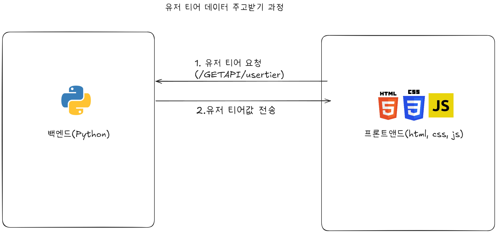
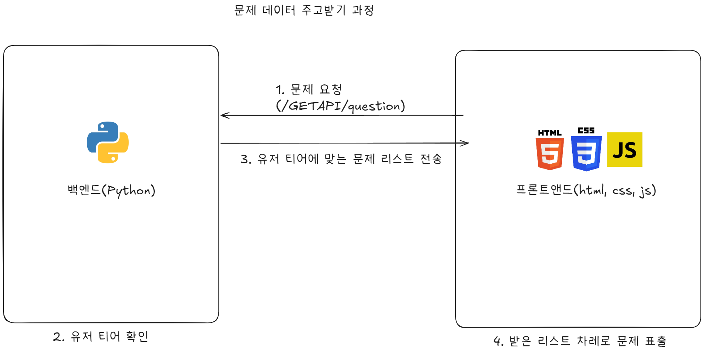
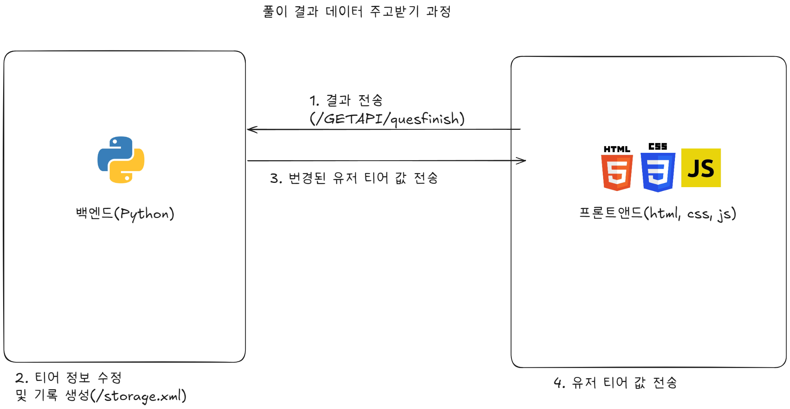

# MathQuestion-to-User

유저의 티어에 맞는 수학문제를 추천하는 프로젝트입니다. 
# ----규칙---- 
각자의 브랜치에서 작업한 뒤, pull requests를 열어서 main 브랜치에 올립니다. 
내가 만든 main을 향한 pull requests는 자신이 닫을 수 없습니다. 
다른 사람의 브랜치를 가져올 수는 있지만, 수정하거나 삭제할 수 없습니다. 

<strong>티어 정보</strong>

## 티어 기준
0번 이상 레슨 : 1-F 
3번 이상 레슨 : 1-E 
6번 이상 레슨 : 1-D 
10번 이상 레슨 : 1-C 
15번 이상 레슨 : 1-B 
20번 이상 레슨 : 1-A 

<b>25번 이상 레슨 시 2티어 진입 가능</b> 
2티어 중에서도 아이언, 브론즈, 실버, 골드로 나뉩니다. 
<i>2티어부터는 티어 점수가 생겨서 더 자세한 실력을 판단할 수 있습니다.</i>

### 2티어 상세

<h4 style="color:rgb(180, 100,110)">티어 점수 0~199: 2-브론즈</h4>
이 티어는 이제 막 랭크를 시작한 유저가 있는 티어로 주로 `(세자리수) + (두자리수)`, `(10~29) * (1~9)` 등이 나옵니다.

<h4 style="color:rgb(100,100,100)">티어 점수 200~399: 2-실버</h4>
이 티어는 어느 정도 사용법을 익힌 유저가 있는 티어로 주로 `(네자리) + (두자리)`, `(세자리) + (세자리)`, `(두자리) * (한자리)`가 나옵니다.

<h4 style="color:rgb(230,230,0)">티어 점수 400~599: 2-골드</h4>
<b>초보의 마지노선</b> 
초보 단계는 이 단계에서 끝납니다. 이 단계는 주로 `(네자리) + (세자리)`가 나오며 `(두자리) * (10~19)`도 출제될 수 있습니다. 
이 단계에서 올라가면 3티어가 되며, 3티어는 티어 점수 600이 되어야 올라갈 수 있습니다.

## 3티어
### 3-플래티넘-1
예정

### 3-플래티넘-2
예정

### 3-플래티넘-3
예정

### 3-루비-1
예정

### 3-루비-2
예정

### 3-다이아몬드-1
예정

### 3-다이아몬드-2
예정

## 4티어
지금은 여기까지

<strong>리포지토리 정보</strong>

## 기술 스택
- Backend: Python
- Frontend: HTML, CSS, JavaScript
- 개인용 `exe`도 제공하며 프론트엔드에서 다운로드할 수 있습니다.

## 개발자
- Backend 주 개발자: `program416`
- Frontend 주 개발자: `dani-Devofficial`

<h4>주 개발자는 주로 개발하는 언어를 기준으로 작성되었으며, <code>program416</code>은 HTML, CSS, JavaScript도 검토할 수 있습니다.</h4>

## 주요 디렉터리
- `utils/`: 데이터 처리 유틸리티
- `web/`: 웹 화면 및 스타일
- `data/`: 프로젝트 데이터 저장 영역
- `README/`: README에 표시하는 이미지 리소스

## 추천 문제 표출 기준
/questionsdata 에 있는 lesson*.txt를 참조하여 랜덤으로 문제 생성.
예시: lesson1.txt에 "n+n"이면 "{랜덤수}+{랜덤수}"로 생성

<strong>데이터 주고받기 과정</strong>

사용자 정보와 티어 데이터가 어떻게 문제 추천과 완료 처리까지 이어지는지 한눈에 볼 수 있도록 정리했습니다.

## 1. 사용자 티어 확인
사용자의 현재 학습 상태와 티어를 먼저 확인합니다.

## 2. 문제 제공
확인된 티어를 기준으로 적절한 수학 문제를 제공합니다.

## 3. 풀이 완료 및 결과 반영
문제 풀이가 끝나면 결과를 반영하고 다음 추천에 활용합니다.

